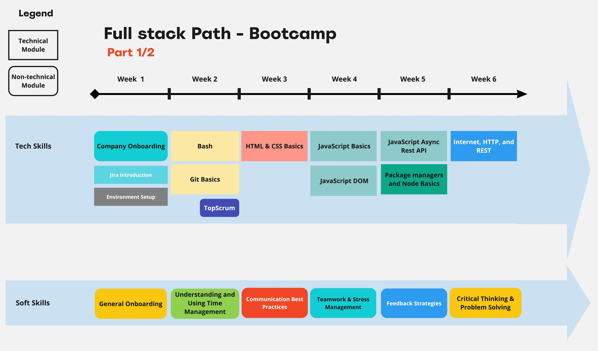
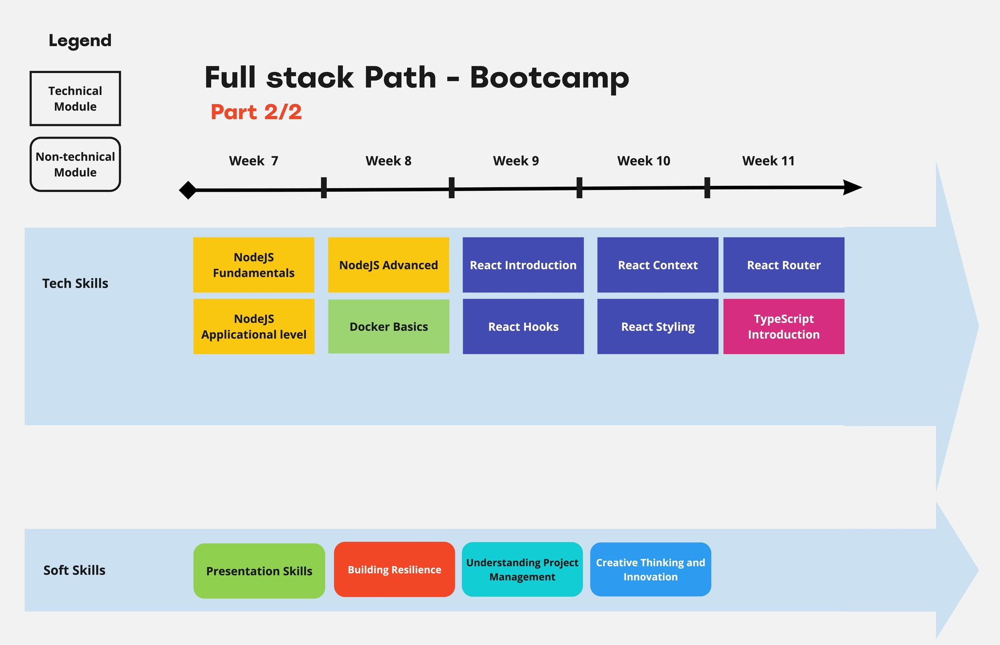
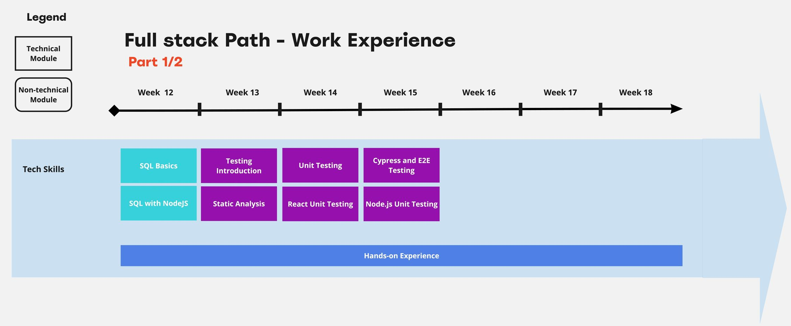

# Full stack React and Node.js Learning path

## Weeks 1-6

[📁 Bash](bash-lesson)

[📁 Git](git-lesson)

[📁 HTML & CSS](html-css-lesson)

[📁 JavaScript Basics](javascript-basics)

[📁 JavaScript DOM](javascript-dom)

[📁 JavaScript Async REST API](javascript-async-rest-api)

[📁 Package managers and Node Basics](package-managers-node-basics)

[📁 Internet, HTTP, and REST](internet-http-rest)

## Weeks 7-11

[📁 NodeJS Fundamentals](nodeJS-fundamentals)

[📁 NodeJS Applicational level](nodeJS-applicational-level)

[📁 NodeJS Advanced](nodeJS-advanced)

[📁 Docker Basics](docker-basics)

[📁 React Introduction](react-introduction)

[📁 React Hooks](react-hooks)

[📁 React Context](react-context)

[📁 React Styling](react-styling)

[📁 React Router](react-router)

[📁 TypeScript Introduction](typescript-introduction)

## Weeks 12-18

[📁 SQL Basics](sql-basics)

[📁 SQL with NodeJS](sql-nodeJS)

[📁 Testing Introduction](testing-introduction)

[📁 Static Analysis](static-analysis)

[📁 Unit Testing](unit-testing)

[📁 React Unit Testing](react-unit-testing)

[📁 Cypress and E2E Testing](cypress-e2e-testing)

[📁 NodeJS Unit Testing](nodeJS-unit-testing)
