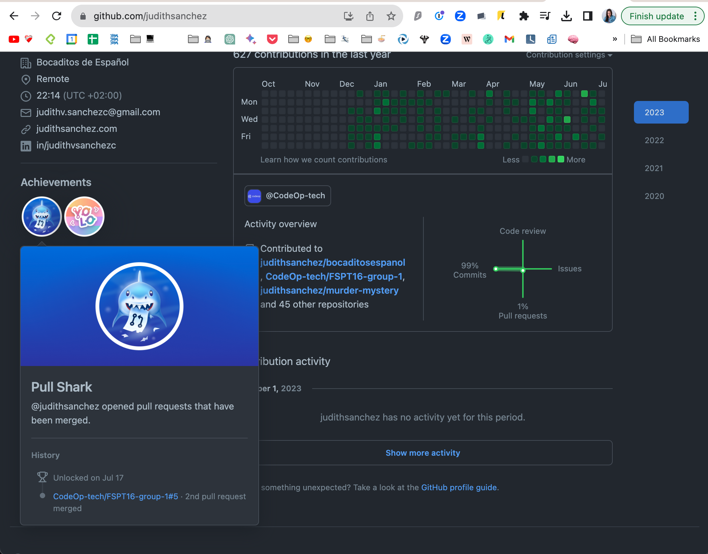

# Task 3

- Invite one of your teammates to the repo and ask to be invited to theirs (Collaborate with your teammates to keep the invitations balanced between all of you)

On their repository:

- Clone it locally
- Create a new branch
- Push a file to the branch
- Create a pull request on GitHub

On your repository:

- Wait for them to create the pull request
- Review the pull request and merge it into master/main

### Here's proof that I've done it before 👻

https://github.com/judithsanchez/murder-mystery

