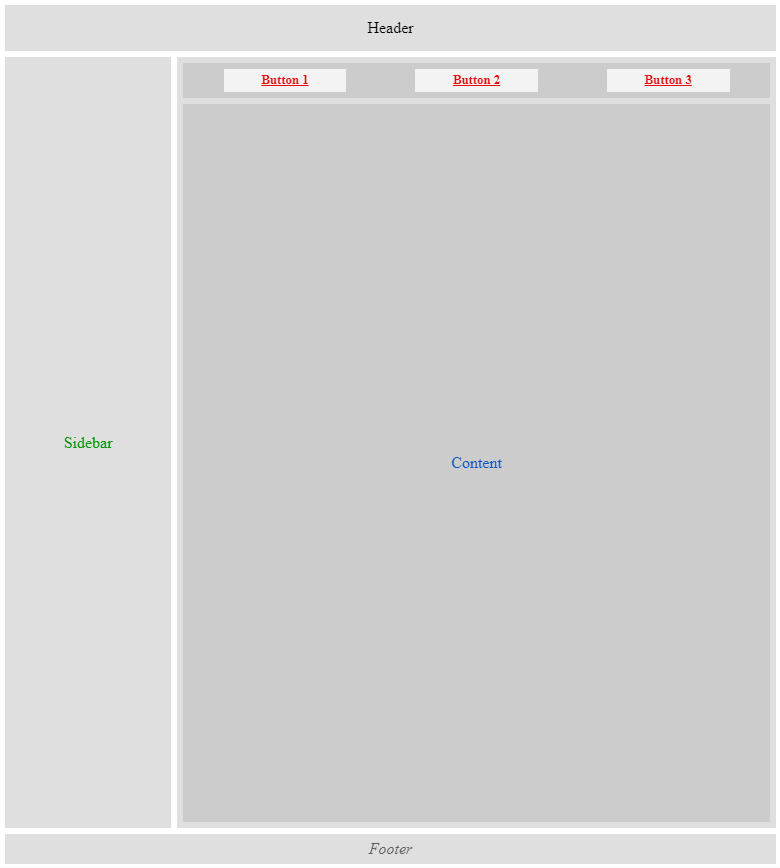

## Task 4

Create an HTML page using variables:

- --light-gray
- --medium-gray
- --dark-gray
- --green
- --blue
- --red
- --gap

Layout requirements:

- Sidebar and Content fill available vertical space
- The layout fills the page with a 6px gap on each side.

